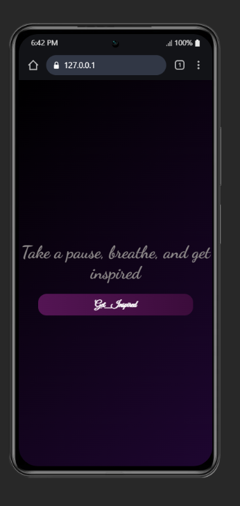
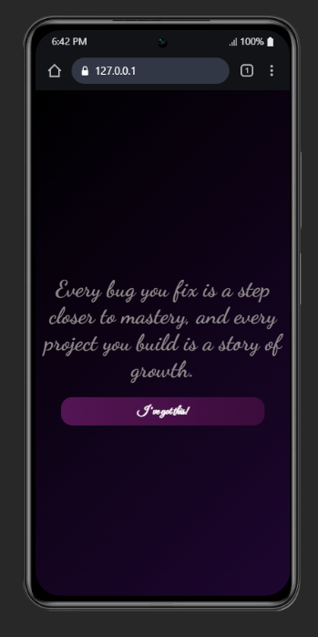
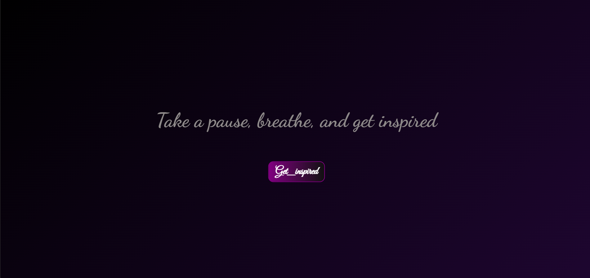
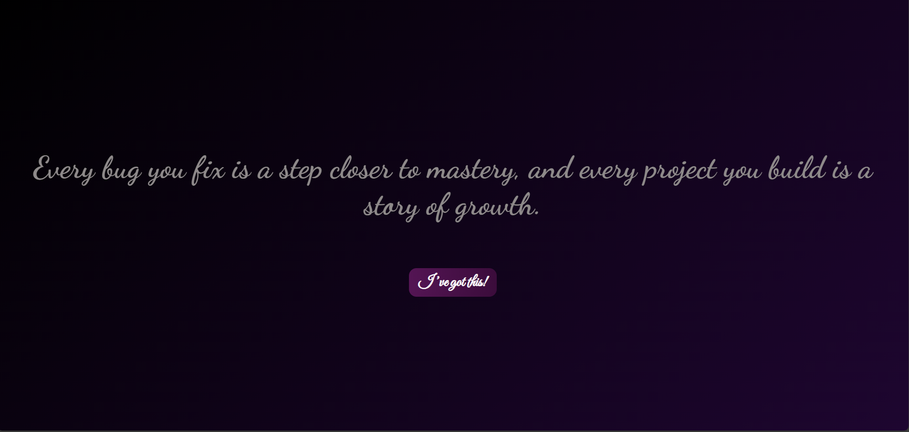

# Project-3: Toggle Quote App ✨

## 📖 Overview
Project-3 is a simple yet inspiring web app that displays motivational quotes with a toggle button.  
It’s designed to uplift users while showcasing clean HTML, CSS, and JavaScript integration.

When the button is clicked:
- The heading text alternates between a calm reminder and a motivational coding quote.
- The button label changes to reflect the user’s state of inspiration.

---

## 🚀 Features
- **Dynamic Quote Toggle**: Switch between two motivational messages.
- **Button Text Update**: Button label changes to match the quote (e.g., *Get_Inspired* → *I’m already motivated!*).
- **Responsive Design**: Centered layout with flexbox for all screen sizes.
- **Modern Styling**: Gradient background, Google Fonts, hover effects, and smooth transitions.

---

## 🛠️ Technologies Used
- **HTML5** – Structure of the app
- **CSS3** – Styling with gradients, fonts, and hover effects
- **JavaScript (ES6)** – DOM manipulation and event handling
- **Google Fonts** – Custom typography for headings and buttons

---

## 🚀 Features - **Dynamic Quote Toggle**: Switch between two motivational messages. - **Button Text Update**: Button label changes to match the quote (e.g., *Get_Inspired* → *I’m already motivated!*). - **Responsive Design**: Centered layout with flexbox for all screen sizes. - **Modern Styling**: Gradient background, Google Fonts, hover effects, and smooth transitions.

## 🛠️ Technologies Used - **HTML5** – Structure of the app - **CSS3** – Styling with gradients, fonts, and hover effects - **JavaScript (ES6)** – DOM manipulation and event handling - **Google Fonts** – Custom typography for headings and buttons
-----

## ✨ Future Improvements
- Add a **list of multiple quotes** that cycle randomly with each click.  
- Introduce **animated transitions** (fade in/out or typewriter effect) for smoother text changes.  
- Allow users to **add their own quotes** via an input field.  
- Store quotes and button states using **localStorage** so they persist across sessions.  
- Expand button labels into a **rotating set of affirmations** (e.g., *I’ve got this!*, *Time to shine!*, *Confidence activated!*).  
- Enhance accessibility with **ARIA labels** and improved contrast for readability.  
- Deploy the project online (e.g., GitHub Pages, Netlify) so it’s easily shareable.

---
## 📸 Screenshots

## 📬 Contact
You can reach me at:  
- 📧 Email: [mariyatawfik6@gmail.com] 
- 💼 LinkedIn: [linkedin.com/in/marya-tawfik] 
- 🐙 GitHub: [github.com/MaryaTawfik]  
- 💡 LeetCode: [leetcode.com/u/gAeoNavwKy]